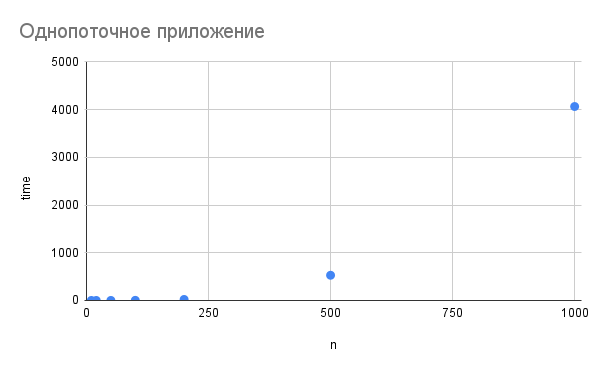
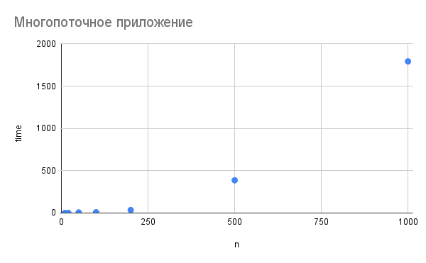
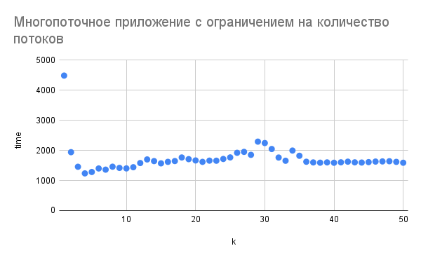

# Итеративный параллелизм

## Однопоточное приложение

[single-thread-app.cpp](single-thread-app.cpp)

Реализовать программу для умножение матриц без использования потоков. Проверить правильность работы полученной
программы. Определить время работы на квадратных матрицах N x N , заполненных случайными числами, при N = 10, 20, 50,
100, 200, 500, 1000.

Вывод:

| n    | time     |
|------|----------|
| 10   | 0.005466 |
| 20   | 0.033057 |
| 50   | 0.480745 |
| 100  | 2.55023  |
| 200  | 21.1078  |
| 500  | 528.072  |
| 1000 | 4065.06  |

## Многопоточное приложение

[multi-thread-app.cpp](multi-thread-app.cpp)

Ускорить программу из предыдущего задания, производя вычисления каждой строки результирующей матрицы в отдельном потоке.
Сравнить время работы с программой без потоков.

Вывод:

| n    | time     |
|------|----------|
| 10   | 0.667936 |
| 20   | 1.07297  |
| 50   | 6.28681  |
| 100  | 8.47526  |
| 200  | 34.8458  |
| 500  | 386.951  |
| 1000 | 1793.14  |

## Многопоточное приложение с ограничением на количество потоков

[k-thread-app.cpp](k-thread-app.cpp)

Вместо вычисления каждой строки в отдельном потоке в прошлом задании, организовать вычисление в виде K потоков, каждый
из которых будет вычислять некоторое их подмножество. Исследовать зависимость времени работы на матрицах N = 1000 от
количества потоков при K = 1, 2, ... , 50.

Вывод:

| k  | time    |
|----|---------|
| 1  | 4488.5  |
| 2  | 1941.38 |
| 3  | 1456.69 |
| 4  | 1236.41 |
| 5  | 1282.93 |
| 6  | 1400.04 |
| 7  | 1360.9  |
| 8  | 1458.82 |
| 9  | 1418.4  |
| 10 | 1402.17 |
| 11 | 1441.5  |
| 12 | 1580.23 |
| 13 | 1700.03 |
| 14 | 1645.08 |
| 15 | 1570.22 |
| 16 | 1619.9  |
| 17 | 1646.31 |
| 18 | 1765.48 |
| 19 | 1709.88 |
| 20 | 1666.66 |
| 21 | 1619.38 |
| 22 | 1659.98 |
| 23 | 1657.38 |
| 24 | 1715.67 |
| 25 | 1767.29 |
| 26 | 1921.17 |
| 27 | 1951.51 |
| 28 | 1853.08 |
| 29 | 2292.34 |
| 30 | 2244.97 |
| 31 | 2047.05 |
| 32 | 1763.38 |
| 33 | 1656.5  |
| 34 | 1995.4  |
| 35 | 1821.82 |
| 36 | 1623.48 |
| 37 | 1601.06 |
| 38 | 1591.97 |
| 39 | 1601.96 |
| 40 | 1589.69 |
| 41 | 1604.61 |
| 42 | 1625.87 |
| 43 | 1603.72 |
| 44 | 1596.69 |
| 45 | 1610.84 |
| 46 | 1629.24 |
| 47 | 1634.14 |
| 48 | 1640.12 |
| 49 | 1619.27 |
| 50 | 1590.26 |
