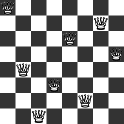

# Синхронизация. Производители и потребители

## Использование разделяемых переменных для передачи данных

[shared-variables.cpp](shared-variables.cpp)

Решить следующую задачу:

С клавиатуры вводится последовательность целых чисел ak, заканчивающаяся числом -1. Вывести все делители каждого числа.

Реализовать её в виде двух потоков, один читает входные данные и отправляет их второму потоку. Второй поток вычисляет
разложение на множители и выводит его. Для передачи данных использовать одну разделяемую переменную.

[shared_int.cpp](attachments/shared_int.cpp)

[thread_pool.cpp](attachments/thread_pool.cpp)

## Задача о N ферзях

[n-queens.cpp](n-queens.cpp) | [N_QUEENS.md](attachments/N_QUEENS.md)

Реализовать поиск и вывод всех решений задачи об N ферзях в виде двух потоков/процессов:

- один (производитель) будет заниматься поиском подходящих конфигураций
- второй (потребитель) будет печатать доски, соответствующие найденным конфигурациям

Передачу конфигураций организовать:

1. используя функцию `popen` для создания канала передачи данных
2. разделяемый массив

Бонусные балл, если вместо вместо печати доски она будет получена в виде изображения.

[stones.cpp](attachments/stones.cpp)
